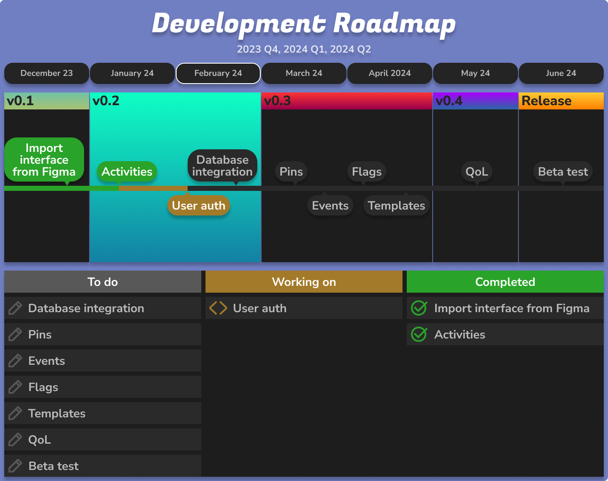

A lightweight calendar app built with VueJS.

# Features

### Activity

An activity spans **minutes to hours**. It is the centrepiece of the calendar.

### Event

An event spans **multiple hours** or even **days**. Activities can be part of an event.

### Flags

Flags act like **reminders**. They don't have a duration.

### Pins

Pins are a different type of reminder. They represent activities or events which have not been created yet. Pins can act as **placeholders**.

### Templates

Templates provide an efficient and flexible way to **create** and **organize** activities. They can represent categories (activities with the same colour and structure).

### Routines

Routines are used to **automatically load** items into your calendar based on the rules you set out.

# Roadmap

The app is currently in version **v0.2.0**.

